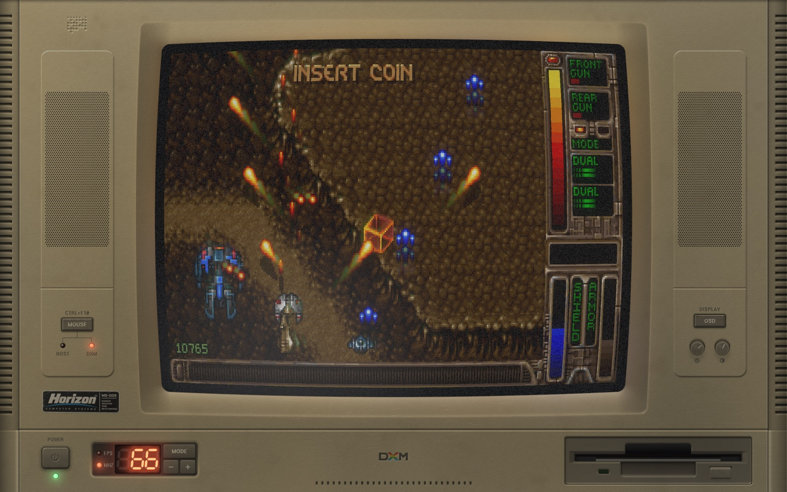
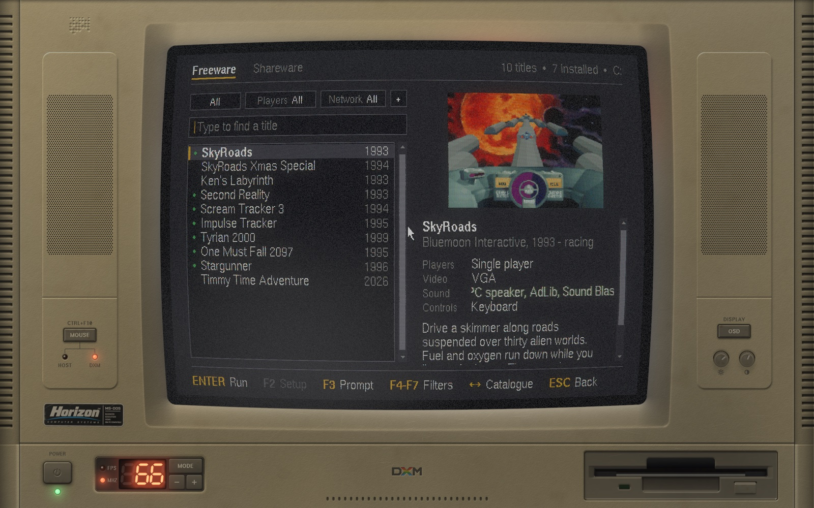
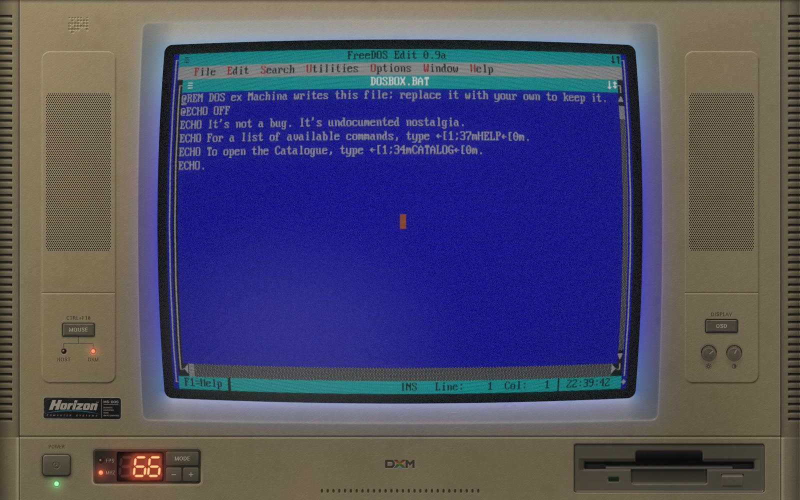
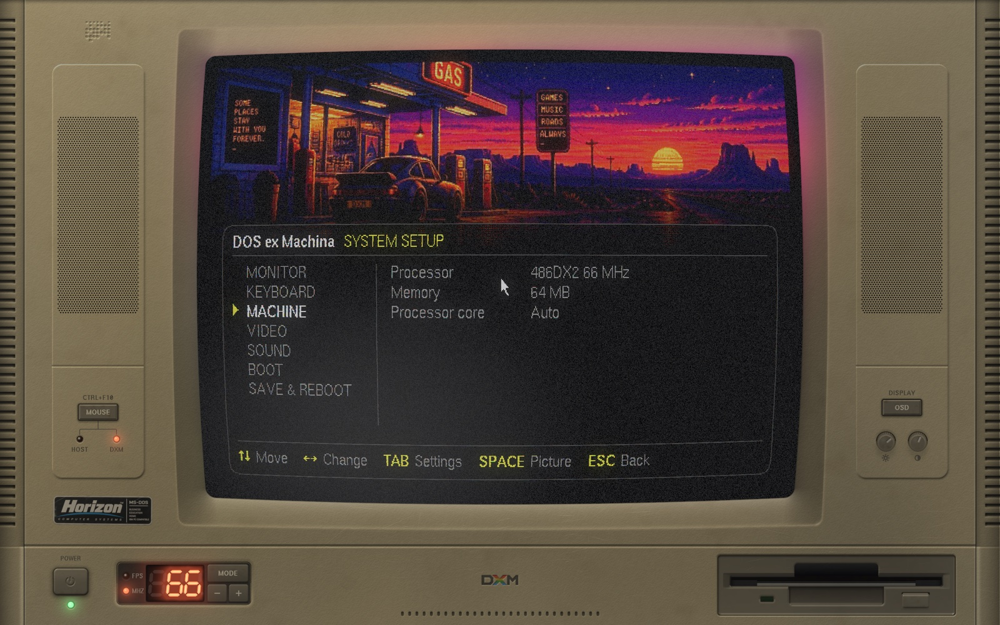

<p align="center">
  
</p>

A 1993 beige-box PC on your screen, case and CRT and all, that boots a real
DOS. The machine powers on, runs its POST, and hands the tube to
[DOSBox Pure][dbp] at the prompt. From there it is a DOS PC: whatever you put
on its C: drive runs behind the same glass, in the same phosphor, with the
case lit by what is on screen.

Nothing here is a photograph. The machine is drawn procedurally at your
display's resolution, and the tube is a real pipeline: phosphor persistence,
barrel curvature, scanlines, an aperture-grille mask, bloom, and light from
the picture spilling onto the plastic around it.

| | |
|---|---|
|  |  |
|  |  |

> [!NOTE]
> **Pre-release.** There are no downloads yet; build it from source, below.
> It runs on macOS, Windows and Linux, on x86_64 and arm64.

## Build and run

```bash
git clone --recursive https://github.com/pedrocatalao/dos-ex-machina
cmake -S dos-ex-machina -B build -DCMAKE_BUILD_TYPE=Release
cmake --build build -j8
./build/dxm
```

It needs SDL3, a C and a C++ compiler, GNU make, and a GPU with OpenGL 3.3
core. [BUILDING.md](BUILDING.md) has the rest: options, the tests, and what
to do where SDL3 is not packaged.

## The first five minutes

- **It boots to a DOS prompt.** `EXIT`, or the power button on the case,
  switches it off properly.
- **C: is a folder** in the machine's preferences directory. Put DOS
  software in it, as folders, and run it from the prompt.
- **`CATALOG`** at the prompt is the shop: freeware and shareware, downloaded
  from where its authors put it and installed onto the machine's drives.
- **Ctrl+F10** hands the mouse back to your desktop and takes it again. The
  keyboard goes with it, so your desktop's shortcuts are off while the
  machine has the mouse.
- **SPACE** during the POST, or **`SETUP`** at the prompt, opens the
  machine's configuration: processor, memory, keyboard, MIDI, the 3dfx card.
- **Shift+F1**, or the OSD key on the case, opens the monitor's own
  on-screen display for the tube's settings.
- **`dxm.log`**, in the preferences directory, is the bug report if
  something goes wrong.

[MANUAL.md](MANUAL.md) covers all of it properly.

## Documents

| | |
|---|---|
| [MANUAL.md](MANUAL.md) | Using the machine: the C: drive, the controls on the case, SETUP, CATALOG, the OSD, MIDI, command-line flags, known gaps |
| [BUILDING.md](BUILDING.md) | Requirements, build options, the tests, formatting |
| [ARCHITECTURE.md](ARCHITECTURE.md) | The map of the code: what is where, how a frame is made, how DOSBox fits in |
| [SPEC.md](SPEC.md) | The machine itself: how the layout is solved, the tube pipeline pass by pass, the light on the case |
| [THIRD-PARTY.md](THIRD-PARTY.md) | What it is built on, and under which licences |

An earlier incarnation ran natively ported DOS games behind a simulated
prompt instead of a real DOS. That code is on the [`legacy`][legacy] branch.

## Licence

GPL-2.0-or-later; see [LICENSE](LICENSE). The DOSBox Pure core it carries is
GPL-2.0, built from [a fork][fork] pinned as a submodule. No software or
data for DOS is in this repository: the catalogue downloads what its authors
give away, from where they put it, when you ask for it.
[THIRD-PARTY.md](THIRD-PARTY.md) has the full list.

[dbp]: https://github.com/schellingb/dosbox-pure
[fork]: https://github.com/pedrocatalao/dosbox-pure/tree/dosexmachina
[legacy]: https://github.com/pedrocatalao/dos-ex-machina/tree/legacy
