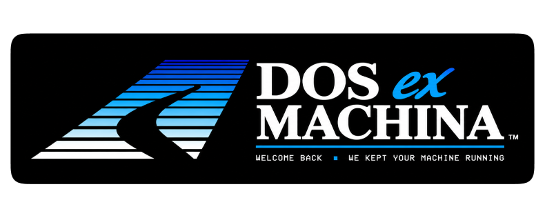

<p align="center">
  
</p>

A 1993 beige-box PC on your screen — case, CRT and all — booting a simulated
DOS prompt, from which you install and run **natively ported** DOS games. The
games run in the same tube, behind the same glass, with the same phosphor.

> **Beta.** It works end to end on macOS, Windows and Linux. The catalogue has
> one game in it, and the downloads are unsigned, so each platform's
> first-run warning applies. See Status.

Nothing here is a photograph. The machine is drawn procedurally at your
display's resolution, from signed-distance geometry and a lighting model: the
moulding partings, the speaker pods, the vent cuts, the ejector-pin marks and
thirty years of wear are all solved, not painted. The tube is a real pipeline
— phosphor persistence, barrel curvature, footprint-integrated scanlines, an
aperture-grille mask, bloom, and coloured light spilling from the picture onto
the plastic around it.

<p align="center">
  
  
</p>

The games are not emulated. Each is a native C port that also ships as a
standalone game in its own right — [SkyRoads][sr] runs perfectly well on its
own — and DXM is the optional machine you can put it inside.
[PORTING.md](PORTING.md) is the contract a port satisfies to run here.

[sr]: https://github.com/pedrocatalao/skyroads-sdl

## Getting a game

DXM ships with no games and links none. Type `NC` at the prompt for the
navigator: a table of what is installed and what could be, with each game's
release and when you last played it. Enter plays the highlighted game, or
downloads it if it's not on the disk yet.

<p align="center">
  
</p>

The navigator's keys are on its bottom row, as they were on the real thing:
**F1** help, **F2** delete a game, **F3** reset one (its saved games and
settings go, the game stays), **F4** update it when the catalogue offers a
newer release, **F10** or Esc back to the prompt. **Tab** moves between the
panels; with the description focused, the arrows scroll it.

The catalogue is [`catalogue.json`](catalogue.json), fetched at run time and
cached on disk — so adding a game is an edit to that file rather than a new
release of DXM, and a machine that has been online once keeps working offline
afterwards.

An install fetches the game's `.dxm` module and its data, checks both against
the SHA-256 the catalogue names, and unpacks them into `<prefs>/games/<id>/`,
keeping the data archive beside them so a reset needs no network. After that
the game runs with no network, forever. Nothing DXM downloads lives in the
repository or the build tree, so a rebuild never costs you a download.

Game data is never mirrored here: for freeware titles the catalogue points at
the publisher's own download.

## How a game plugs in

A game is a `.dxm` **module**, opened at run time with `dlopen`/`LoadLibrary`.
It exports exactly three symbols — `dxm_core_get_info`, `dxm_core_main`,
`dxm_core_audio` — and hides everything else, so two games can be loaded at
once without their globals colliding.

The module carries the shared adapter inside it and links **no SDL and no
threading library of its own**, which is what makes it loadable everywhere DXM
runs. `dxm_core_info.abi` is checked before anything starts, so a module built
against a different version of the contract is refused with a message saying
which side needs updating.

## Installing

Every release is self-contained: unpack it and run it.

On macOS the release is a `DOS ex Machina.app` bundle. It is ad-hoc signed
rather than notarised, so the first launch needs **right-click → Open** —
double-clicking will refuse it. If it still balks, System Settings → Privacy
and Security → General has an **Open Anyway** button.

On Windows, unzip and run `dxm.exe` — the DLLs it needs are in the same
folder and nothing has to be installed. The executable is unsigned, so
SmartScreen will show *"Windows protected your PC"* the first time: **More
info → Run anyway**.

On Linux the tarball runs from wherever you unpack it — `./dxm`. If you want
it in your applications menu, `./install.sh` puts it under `~/.local`, writes
a desktop entry and installs the icon. It needs no root, touches nothing
system-wide, and does not modify your shell configuration or `PATH`; it
prints exactly what to delete to undo it.

## Build

Needs SDL3, libcurl and zlib, and an **OpenGL 3.3 core** context at run time.
curl and zlib are system libraries everywhere DXM targets. SDL3 is not yet in
Ubuntu's archive, so on Linux it has to be built from source or taken from the
release tarball, which carries it.

```bash
cmake -S . -B build -DCMAKE_BUILD_TYPE=Release
cmake --build build -j8
./build/dxm
```

No game checkout is needed — DXM builds and ships on its own. The tube's
shaders are the GLSL files under `shaders/`, baked into the binary at build
time; nothing is read from disk at run time.

`-DDXM_SANITIZE=ON` builds with AddressSanitizer and UndefinedBehaviorSanitizer;
CI runs the whole test set that way on Linux under Mesa's software renderer.
The C is formatted with the project's `.clang-format`; `tools/format.sh`
applies it and CI checks it with the same pinned release of clang-format.
`ctest --test-dir build` runs the tests: unit tests for the modules that
need no display (`-L unit`, also run by CI), and the golden-frame test
(`-L golden`), which draws the machine under `--deterministic` and compares
it pixel for pixel with the reference frames in `tests/golden/references/`;
see the README there for when and how those change.

## Using it

Fullscreen is real fullscreen: the case fills the display edge to edge with no
background around it. Extra width becomes more machine — wider bays, wider
speaker columns on ultrawide — never letterboxing.

The machine boots: POST, memory count, `AUTOEXEC.BAT`. At the `C:\>` prompt:

| | |
|---|---|
| `NC` | the navigator — browse, download, play |
| `DIR`, `CD` | the games live in `C:\GAMES` |
| `TYPE`, `MORE` | `TYPE README.1ST` is the machine's own introduction |
| `CLS`, `VER`, `HELP` | as you would expect |
| `EXIT` | switch the machine off |

`C:\` holds what a 1993 boot disk held — `COMMAND.COM`, `AUTOEXEC.BAT`,
`CONFIG.SYS`, `README.1ST`, `NC.EXE` — all of it part of the machine rather
than files on your computer. `DIR` lists them and `TYPE` reads them, a
screen at a time when a file is long; `| MORE` pages any other command.

A game runs from the directory it is in, so `CD GAMES` then its name — DOS did
not search the disk for you. `NC` reaches them from anywhere, and a game
started from the navigator returns to it.

**The two knobs** under the right speaker are brightness and contrast: grab
one with the mouse and drag up or down. **F1** opens a panel over the tube
with the rest of the CRT — bloom, burn-in, static, jitter, glow line, ambient
light, flicker, h-sync, RGB shift, chassis glow, persistence, scanlines, pixel
grid, curvature. Everything saves to `crt.cfg` in the preferences directory.

The machine holds the mouse: no pointer, nothing to chase. **Ctrl+F10**
gives it to your operating system when you want the knobs, and takes it back.
Esc out of a game returns to wherever it
was started from; the machine survives it and the game can be relaunched.
`EXIT` powers down properly: the raster collapses, the fans spin down, and the
room goes dark.

Dev flags: `--windowed`, `--size WxH`, `--type "CMD;CMD"`,
`--shot out.bmp --frames N`, `--deterministic` (a fixed 60 Hz clock and the
shipped CRT defaults, so a given frame is the same picture on every run),
`--selftest`, `--ambient N`, `--dump-audio FILE`.

## Status

**macOS**, **Windows** and **Linux** all do the whole thing on real hardware:
boot → `C:\>` → `NC` → download a game → it runs in the tube → Esc → back →
it relaunches. Windows and Linux are verified on x86_64; the arm64 builds
compile and package on CI but have not yet been watched drawing a frame, and
neither has the Intel half of the macOS universal binary. `--selftest` runs
the launch/unwind/relaunch sequence twice, and is what proves PORTING §3.1
and §3.2 hold.

Every run writes `dxm.log` to the preferences directory — Windows
`%APPDATA%\DOSexMachina\dxm\`, Linux `~/.local/share/DOSexMachina/dxm/`,
macOS `~/Library/Application Support/DOSexMachina/dxm/` — with a timestamp
for each startup step and the GL driver in use. If something goes wrong, that
file is the bug report.

The **core module** — the game side of the contract — is verified on all three
platforms and both architectures by the game repository's CI.

## Requirements

An **OpenGL 3.3 core** context. That rules out most virtual machines: virgl on
an Apple Silicon host offers only a 2.1 compatibility profile, and Windows
without a GPU driver gives Microsoft's software GL 1.1. On Linux you can force
Mesa's software rasteriser with `LIBGL_ALWAYS_SOFTWARE=1`, which works but is
far too slow to be pleasant. If DXM cannot get what it needs it says so on
screen, naming the driver and the functions that were missing.

## Known gaps

- **The catalogue has one game in it.**
- **Unsigned.** macOS and Windows each show a first-run warning; see
  Installing for the way through it.
- **arm64 Linux and Windows are unverified on hardware.** They build and
  package; nobody has run them yet.
- Games have no mouse: the host contract is keyboard only, which is what the
  one game in the catalogue needs.

## License

MIT — see [LICENSE](LICENSE). Three things worth stating alongside it:

- **No game code or game data is in this repository.** A game arrives as a
  separately licensed native port; its publisher retains every right in the
  original work, and nothing here grants any right in any game.
- **SDL3, libcurl and zlib are dependencies, not components** — linked, not
  vendored, and distributed by their own authors under their own terms.
- **The Sound Blaster wordmark** on the modelled case is a trademark of
  Creative Technology Ltd. It appears as a period detail — the sticker these
  machines carried — not as a claim of ownership or a suggestion of any
  affiliation.

## Design notes

[SPEC.md](SPEC.md) covers the machine: how the layout is solved from the host
resolution, the tube pipeline pass by pass, and why every decision that could
differ between platforms is pinned down instead.

[PORTING.md](PORTING.md) is the normative contract for a port: no `exit()`, no
stdio, no SDL, no working-directory assumptions, restartable state, declared
video modes, and audio pulled rather than pushed.
