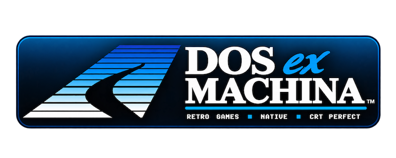
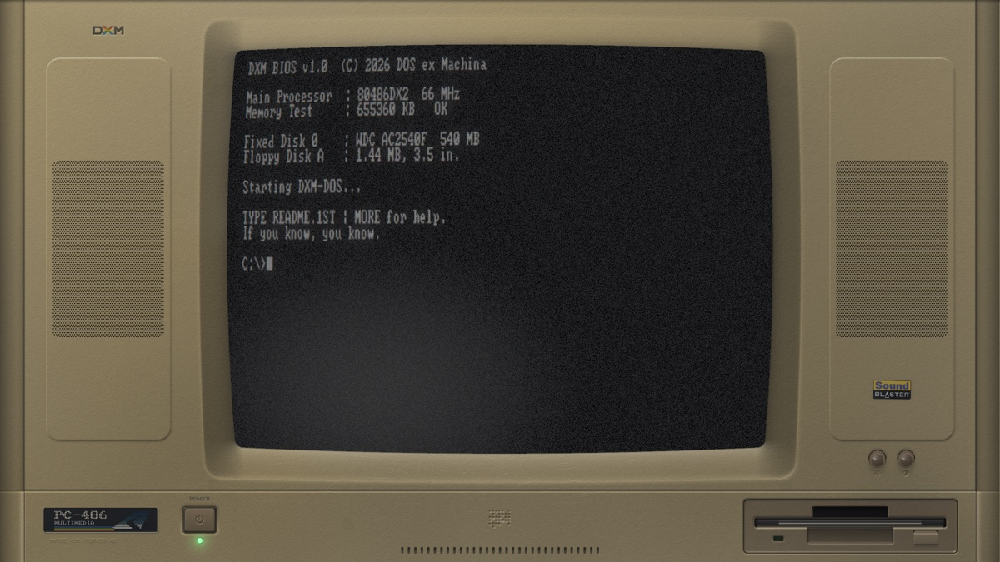
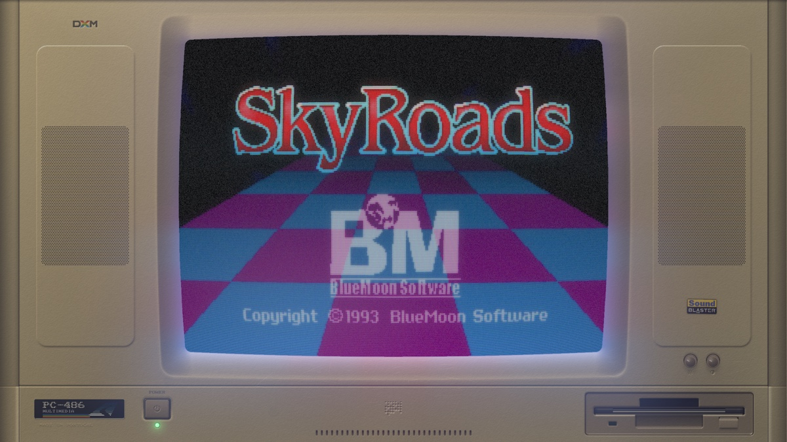
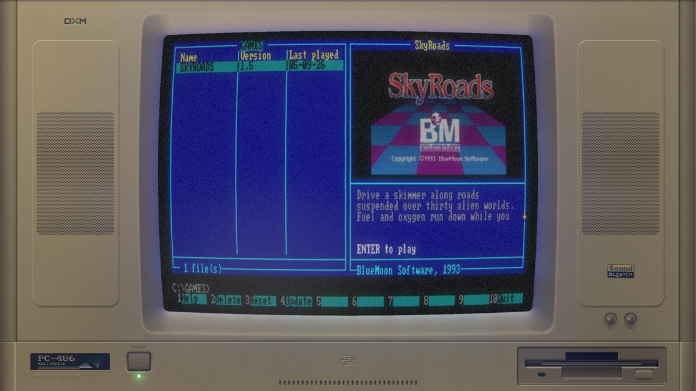

<p align="center">
  
</p>

A 1993 beige-box PC on your screen — case, CRT and all — booting a simulated
DOS prompt, from which you install and run **natively ported** DOS games. The
games run in the same tube, behind the same glass, with the same phosphor.

> **Early development.** It builds and runs on macOS, Linux and Windows, but
> only macOS has been through the whole thing with a real GPU — and the
> catalogue has one game in it. Things will move around.

Nothing here is a photograph. The machine is drawn procedurally at your
display's resolution, from signed-distance geometry and a lighting model: the
moulding partings, the speaker pods, the vent cuts, the ejector-pin marks and
thirty years of wear are all solved, not painted. The tube is a real pipeline
— phosphor persistence, barrel curvature, footprint-integrated scanlines, an
aperture-grille mask, bloom, and coloured light spilling from the picture onto
the plastic around it.

<p align="center">
  
  
</p>

The games are not emulated. Each is a native C port that also ships as a
standalone game in its own right — [SkyRoads][sr] runs perfectly well on its
own — and DXM is the optional machine you can put it inside.
[PORTING.md](PORTING.md) is the contract a port satisfies to run here.

[sr]: https://github.com/pedrocatalao/skyroads-sdl

## Getting a game

DXM ships with no games and links none. Type `NC` at the prompt for the
navigator: it lists what is installed and what could be, and Enter downloads
the highlighted one.

<p align="center">
  
</p>

The catalogue is [`catalogue.json`](catalogue.json), fetched at run time and
cached on disk — so adding a game is an edit to that file rather than a new
release of DXM, and a machine that has been online once keeps working offline
afterwards.

An install fetches the game's `.dxm` module and its data, checks both against
the SHA-256 the catalogue names, and unpacks them into `<prefs>/games/<id>/`.
After that the game runs with no network, forever. Nothing DXM downloads lives
in the repository or the build tree, so a rebuild never costs you a download.

Game data is never mirrored here: for freeware titles the catalogue points at
the publisher's own download.

## How a game plugs in

A game is a `.dxm` **module**, opened at run time with `dlopen`/`LoadLibrary`.
It exports exactly three symbols — `dxm_core_get_info`, `dxm_core_main`,
`dxm_core_audio` — and hides everything else, so two games can be loaded at
once without their globals colliding.

The module carries the shared adapter inside it and links **no SDL and no
threading library of its own**, which is what makes it loadable everywhere DXM
runs. `dxm_core_info.abi` is checked before anything starts, so a module built
against a different version of the contract is refused with a message saying
which side needs updating.

On macOS the release is a `DOS ex Machina.app` bundle. It is ad-hoc signed
rather than notarised, so the first launch needs **right-click → Open** —
double-clicking will refuse it. If it still balks, System Settings → Privacy
and Security → General has an **Open Anyway** button.

On Windows, unzip and run `dxm.exe` — the DLLs it needs are in the same
folder and nothing has to be installed. The executable is unsigned, so
SmartScreen will show *"Windows protected your PC"* the first time: **More
info → Run anyway**.

On Linux the tarball runs from wherever you unpack it — `./dxm`. If you want
it in your applications menu, `./install.sh` puts it under `~/.local`, writes
a desktop entry and installs the icon. It needs no root, touches nothing
system-wide, and does not modify your shell configuration or `PATH`; it
prints exactly what to delete to undo it.

## Build

Needs SDL3, libcurl and zlib, and an **OpenGL 3.3 core** context at run time.
curl and zlib are system libraries everywhere DXM targets. SDL3 is not yet in
Ubuntu's archive, so on Linux it has to be built from source or taken from the
release tarball, which carries it.

```bash
cmake -S . -B build -DCMAKE_BUILD_TYPE=Release
cmake --build build -j8
./build/dxm
```

No game checkout is needed — DXM builds and ships on its own.

## Using it

Fullscreen is real fullscreen: the case fills the display edge to edge with no
background around it. Extra width becomes more machine — wider bays, wider
speaker columns on ultrawide — never letterboxing.

At the `C:\>` prompt:

| | |
|---|---|
| `NC` | the navigator — browse, download, play |
| `DIR`, `CD` | the games live in `C:\GAMES` |
| `TYPE`, `CLS`, `VER`, `HELP` | as you would expect |
| `EXIT` | switch the machine off |

A game runs from the directory it is in, so `CD GAMES` then its name — DOS did
not search the disk for you. `NC` reaches them from anywhere.

**F1** opens a settings panel over the tube with sixteen CRT parameters —
bloom, burn-in, static, jitter, glow line, ambient light, flicker, h-sync,
RGB shift, chassis glow, persistence, scanlines, pixel grid, curvature,
brightness, contrast. They save to `crt.cfg` in the preferences directory.

Esc out of a game returns to the prompt; the machine survives it and the game
can be relaunched.

Dev flags: `--windowed`, `--size WxH`, `--type "CMD;CMD"`,
`--shot out.bmp --frames N`, `--selftest`, `--ambient N`, `--dump-audio FILE`.

## Status

**macOS** does the whole thing: boot → `C:\>` → `NC` → download a game → it
runs in the tube → Esc → the prompt again → it relaunches. `--selftest` runs
that launch/unwind/relaunch sequence twice, and is what proves PORTING §3.1
and §3.2 hold.

**Linux and Windows** build, package and launch — CI covers both on x86_64 and
arm64, and the releases are self-contained. What has *not* been confirmed is
how they look: the only machines available for testing were VMs with no
OpenGL 3.3 driver, so the render itself is still unverified there. Everything
short of that works — the tarball resolves its own SDL3, GL 3.3 initialises,
the loader binds every entry point, and the frame loop runs.

The **core module** — the game side of the contract — is verified on all three
platforms and both architectures by the game repository's CI.

## Requirements

An **OpenGL 3.3 core** context. That rules out most virtual machines: virgl on
an Apple Silicon host offers only a 2.1 compatibility profile, and Windows
without a GPU driver gives Microsoft's software GL 1.1. On Linux you can force
Mesa's software rasteriser with `LIBGL_ALWAYS_SOFTWARE=1`, which works but is
far too slow to be pleasant. If DXM cannot get what it needs it says which
functions were missing rather than failing silently.

## Known gaps

- **The render is unverified on Linux and Windows** — see Status.
- **The catalogue has one game in it.**
- The chassis knobs are drawn but not yet interactive; the F1 panel is the
  working control surface.
- The font is an 8x8 ASCII subset row-doubled to 8x16, plus the CP437 line
  drawing the navigator needs — not full CP437.

## License

MIT — see [LICENSE](LICENSE). Three things worth stating alongside it:

- **No game code or game data is in this repository.** A game arrives as a
  separately licensed native port; its publisher retains every right in the
  original work, and nothing here grants any right in any game.
- **SDL3, libcurl and zlib are dependencies, not components** — linked, not
  vendored, and distributed by their own authors under their own terms.
- **The Sound Blaster wordmark** on the modelled case is a trademark of
  Creative Technology Ltd. It appears as a period detail — the sticker these
  machines carried — not as a claim of ownership or a suggestion of any
  affiliation.

## Design notes

[SPEC.md](SPEC.md) covers the machine: how the layout is solved from the host
resolution, the tube pipeline pass by pass, and why every decision that could
differ between platforms is pinned down instead.

[PORTING.md](PORTING.md) is the normative contract for a port: no `exit()`, no
stdio, no SDL, no working-directory assumptions, restartable state, declared
video modes, and audio pulled rather than pushed.
